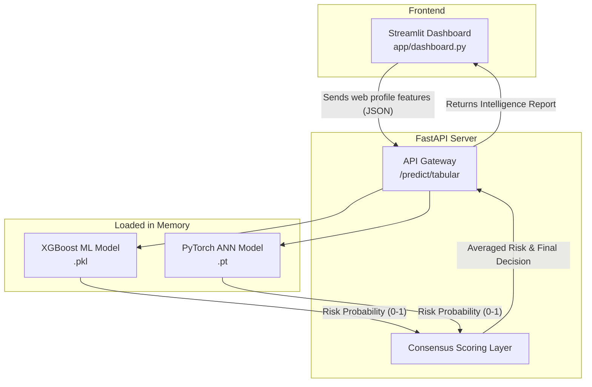

# System Architecture

The Phishing Detection System is designed following strict MLOps and decoupled software engineering principles. By
separating the underlying inference models, the API gateway, and the frontend, the system guarantees high availability,
easy updates, and fault tolerance.

## Architecture Flow Diagram

## 1. Data Processing Pipeline

* **Ingestion**: Tabular data is ingested from `.arff` files.
* **Cleaning**: Byte-strings are decoded into integers. Target variables are mapped to standard binary classification
  formats (`1` for Phishing, `0` for Legitimate).
* **Splitting**: Data is stratified and split into 80% Training and 20% Testing sets.

## 2. Model Training Layers

### Traditional ML Layer (`train_ml.py`)

The system evaluates 8 algorithms using Scikit-Learn and XGBoost frameworks:

* Logistic Regression, Naive Bayes, K-Nearest Neighbors (KNN), Support Vector Machines (SVM), Decision Trees, Random
  Forest, AdaBoost, and XGBoost.
* The top-performing model (based on F1-Score) is automatically serialized using `pickle` into
  `models/best_traditional_ml.pkl`.

### Deep Learning Layer (`train_ann.py`)

A custom PyTorch Artificial Neural Network is trained as a parallel benchmark:

* **Architecture**: Dense Multi-Layer Perceptron (Input -> 64 units -> 32 units -> Output).
* **Activation & Regularization**: ReLU activations and Dropout layers (0.3, 0.2) to prevent overfitting.
* **Loss Function**: `BCEWithLogitsLoss` for safe sigmoid and binary cross-entropy calculations.
* The trained state dictionary is exported as `models/tabular_ann.pt`.

## 3. Deployment Application

### FastAPI Backend (`app/main.py`)

* **Startup Lifecycle**: On server boot, both the XGBoost `.pkl` and the PyTorch `.pt` models are loaded directly into
  RAM.
* **Consensus Endpoint**: `POST /predict/tabular` receives an array of 30 structural integers. It passes the array
  simultaneously to both engines, retrieves their risk probabilities, and averages them to determine the final system
  consensus.

### Streamlit Frontend (`app/dashboard.py`)

* Provides an interactive GUI for end-users.
* Abstracts the underlying data arrays into easy-to-test "Profiles".
* Sends REST HTTP requests to the FastAPI backend and visually formats the returned risk percentages and predictions.

---
