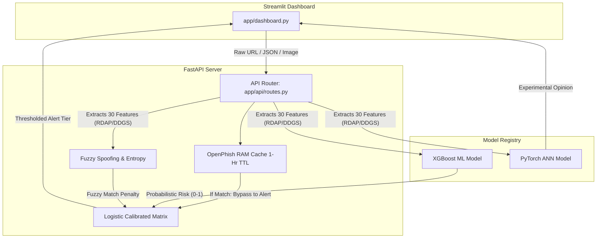

# System Architecture

The Phishing Detection System is designed following strict MLOps and decoupled software engineering principles. By
separating the underlying inference models, the API gateway, and the frontend, the system guarantees high availability,
easy updates, and fault tolerance.

## Architecture Flow Diagram

## 1. Data Processing Pipeline

* **Automated Feature Extraction (`app/data_transformation.py`)**: Uses Python native libraries to fetch HTML and
  perform API-less RDAP lookups. Safely checks search engine indexing using DuckDuckGo (`ddgs`) instead of brittle
  Google HTML scraping to avoid CAPTCHA firewalls.
* **Continuous Heuristics & Typosquatting (`app/heuristics.py`)**: Calculates Shannon Entropy and uses
  `difflib.SequenceMatcher` for Fuzzy String Matching. This catches advanced zero-day obfuscation and unreachable
  typosquatted domains (e.g. `paypdals.com` spoofing `paypal.com`).
* **Local Whitelisting**: Apex domain verification (e.g., `google.com`) to prevent false positives on enterprise
  tracking URLs.

## 2. Model Training Layers

### Traditional ML Layer (`train_ml.py`)

The system evaluates 8 algorithms using Scikit-Learn and XGBoost frameworks:

* Logistic Regression, Naive Bayes, K-Nearest Neighbors (KNN), Support Vector Machines (SVM), Decision Trees, Random
  Forest, AdaBoost, and XGBoost.
* The top-performing model (**XGBoost**) is automatically serialized using `pickle` into
  `models/best_traditional_ml.pkl`.

### Deep Learning Layer (`train_ann.py`)

A custom PyTorch Artificial Neural Network is trained as a parallel benchmark:

* **Architecture**: Dense Multi-Layer Perceptron (Input -> BatchNorm -> Dropout -> Output).
* **Optimization**: Utilizes `AdamW` optimizer and `ReduceLROnPlateau` scheduler to generalize robustly on tabular data.
* **Loss Function**: `BCEWithLogitsLoss` for safe sigmoid and binary cross-entropy calculations.
* The trained state dictionary is exported as `models/tabular_ann.pt`.

## 3. Deployment Application

### FastAPI Backend (`app/main.py`)

The backend is fully modularized for production:

* **`app/api/routes.py`**: Handles incoming HTTP payload validation.
* **`app/services/inference.py`**: Executes the core business logic decoupled from the web framework.
* **`app/services/model_manager.py`**: Acts as a Model Registry, caching AI models safely into RAM.
* **Logistic Calibrated Consensus**: Uses XGBoost as the primary production standard, applying mathematical logit
  penalties from our Fuzzy Heuristics to output a secure consensus tier.

### Streamlit Frontend (`app/dashboard.py`)

* Provides an interactive GUI for end-users, securely extracting configurations via a `.env` file.
* Visually separates the **Production Intelligence** (XGBoost & Threat Feeds) from the **Experimental AI Lab** (PyTorch
  ANN, Vision, NLP) to prevent decision fatigue for security analysts.

---
