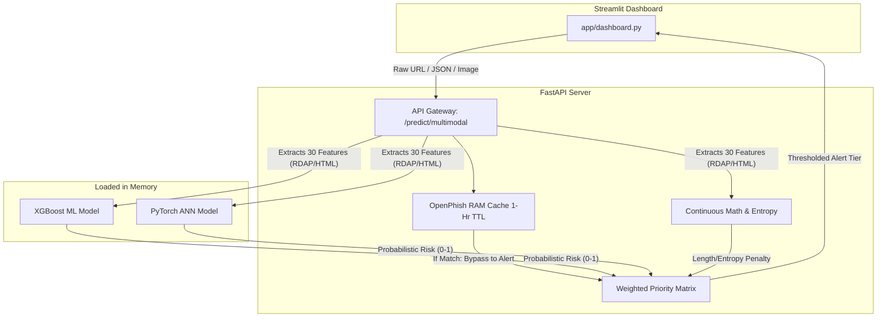

# System Architecture

The Phishing Detection System is designed following strict MLOps and decoupled software engineering principles. By
separating the underlying inference models, the API gateway, and the frontend, the system guarantees high availability,
easy updates, and fault tolerance.

## Architecture Flow Diagram

## 1. Data Processing Pipeline

* **Automated Feature Extraction (`data_transformation.py`)**: Uses Python native libraries (`urllib`, `socket`) to
  fetch HTML and perform API-less RDAP lookups over HTTPS to bypass Port 43 firewalls. Converts live URLs into the
  30-feature UCI array.
* **Continuous Heuristics**: Calculates Shannon Entropy and string length to capture zero-day obfuscation outside of
  rigid categorical constraints.
* **Local Whitelisting**: Apex domain verification (e.g., `google.com`) to prevent false positives on enterprise
  tracking URLs.

## 2. Model Training Layers

### Traditional ML Layer (`train_ml.py`)

The system evaluates 8 algorithms using Scikit-Learn and XGBoost frameworks:

* Logistic Regression, Naive Bayes, K-Nearest Neighbors (KNN), Support Vector Machines (SVM), Decision Trees, Random
  Forest, AdaBoost, and XGBoost.
* The top-performing model (based on F1-Score) is automatically serialized using `pickle` into
  `models/best_traditional_ml.pkl`.

### Deep Learning Layer (`train_ann.py`)

A custom PyTorch Artificial Neural Network is trained as a parallel benchmark:

* **Architecture**: Dense Multi-Layer Perceptron (Input -> 64 units -> 32 units -> Output).
* **Activation & Regularization**: ReLU activations and Dropout layers (0.3, 0.2) to prevent overfitting.
* **Loss Function**: `BCEWithLogitsLoss` for safe sigmoid and binary cross-entropy calculations.
* The trained state dictionary is exported as `models/tabular_ann.pt`.

## 3. Deployment Application

### FastAPI Backend (`app/main.py`)

* **Layer 1 Threat Intelligence**: On boot, downloads the OpenPhish global threat feed into RAM with a 1-hour TTL
  background refresh, dodging network latency per-request.
* **Probabilistic Thresholding**: Discards traditional 0.50 binary bounds. It requires a >0.85 threshold to assert a
  positive ML/ANN hit, heavily prioritizing precision to reduce False Positives.
* **Weighted Priority Matrix**: Averages the XGBoost (60% weight) and ANN (40% weight) along with Continuous Math
  penalties to issue a tiered consensus (`Secure`, `Suspicious`, `Phishing`).

### Streamlit Frontend (`app/dashboard.py`)

* Provides an interactive GUI for end-users, supporting Automated URL extraction, Manual Form profiling, and API JSON
  payload simulation.
* Abstracts the underlying backend logic into visually responsive, multi-metric intelligence reports.

---
